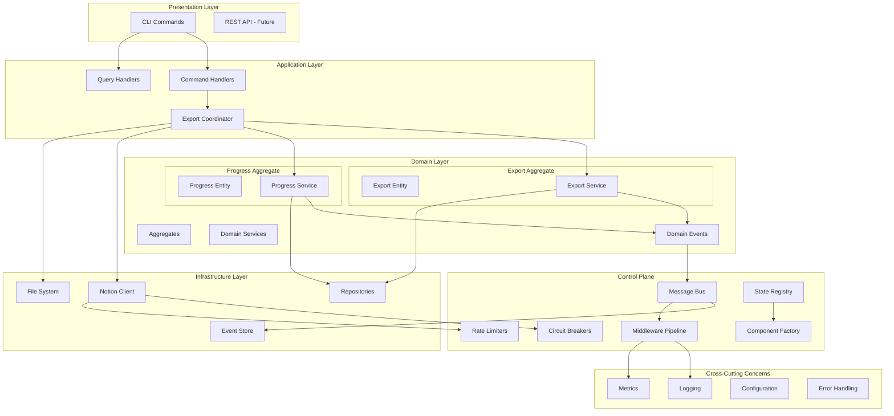
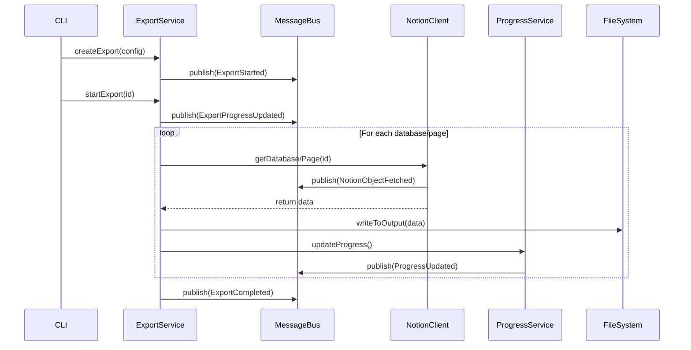

# Notion Sync - Event-Driven Architecture Documentation

## Overview

Notion Sync is designed as an event-driven system for exporting entire Notion workspaces at scale efficiently and stable. The architecture follows Domain-Driven Design (DDD) principles with event sourcing and CQRS patterns to ensure scalability, reliability, and maintainability.

## Architecture Diagram

## Component Dependencies

### Core Domain Components

#### 1. Export Aggregate
- **Location**: `/src/core/domain/export.ts`
- **Dependencies**: 
  - IN: ExportConfiguration, ProgressInfo, ErrorInfo
  - OUT: Domain Events (ExportStarted, ExportCompleted, etc.)
- **Responsibilities**: 
  - Export lifecycle management
  - Business rule enforcement
  - State transitions

#### 2. Export Service
- **Location**: `/src/core/services/export-service.ts`
- **Dependencies**:
  - IN: ExportRepository, EventPublisher
  - OUT: Export entities, Domain events
- **Responsibilities**:
  - Export orchestration
  - Conflict detection
  - Progress coordination

#### 3. Progress Service
- **Location**: `/src/core/services/progress-service.ts`
- **Dependencies**:
  - IN: EventPublisher
  - OUT: Progress events
- **Responsibilities**:
  - Progress tracking
  - ETA calculation
  - Section management

### Infrastructure Components

#### 4. Notion Client
- **Location**: `/src/infrastructure/notion/notion-client.ts`
- **Dependencies**:
  - IN: NotionConfig, EventPublisher, CircuitBreaker
  - OUT: NotionPage, NotionDatabase, NotionBlock, API events
- **Responsibilities**:
  - Notion API integration
  - Rate limit handling
  - Error transformation

#### 5. Control Plane
- **Location**: `/src/lib/control-plane/`
- **Dependencies**:
  - IN: Configuration, Plugins, Middleware
  - OUT: Message routing, Component lifecycle
- **Responsibilities**:
  - Event routing
  - Component orchestration
  - Cross-cutting concerns

### Event Flow

## Current State Analysis

### ✅ Implemented Components

1. **Domain Layer**
   - Export aggregate with proper state management
   - Domain events with factory methods
   - Export and Progress services

2. **Control Plane**
   - Message bus with RxJS and Promise-based channels
   - Circuit breaker implementation
   - Middleware pipeline
   - Plugin system
   - State registry

3. **Infrastructure**
   - Notion API client with error handling
   - Basic file operations
   - Rate limiting and concurrency management

4. **CLI Interface**
   - Export command with event-driven integration
   - Progress monitoring
   - Error handling

### ❌ Missing/Incomplete Components

1. **Persistence Layer**
   - No persistent event store
   - Only in-memory repositories
   - No checkpoint persistence for large exports

2. **File System Operations**
   - Incomplete export format implementations
   - No structured file organization
   - Missing resume capability for file operations

3. **Error Recovery**
   - No dead letter queue
   - Limited retry mechanisms
   - No compensation actions

4. **Monitoring & Observability**
   - Basic logging only
   - No metrics collection
   - No health checks
   - No distributed tracing

5. **Testing Infrastructure**
   - Limited unit tests
   - No integration tests
   - No performance tests

### 🔄 Architectural Issues

1. **Mixed Patterns**
   - Old streaming export manager alongside new event-driven architecture
   - Direct dependencies in some components
   - Inconsistent error handling patterns

2. **Scalability Concerns**
   - In-memory state management
   - No horizontal scaling support
   - Limited concurrency control

3. **Production Readiness**
   - No environment-specific configuration
   - Missing deployment artifacts
   - No monitoring integration

## Event Catalog

### Export Events
- `export.started` - Export process initiated
- `export.progress.updated` - Progress information updated
- `export.completed` - Export finished successfully
- `export.failed` - Export failed with error
- `export.cancelled` - Export cancelled by user

### Notion API Events
- `notion.object.fetched` - Object retrieved from API
- `notion.rate_limit.hit` - Rate limit encountered
- `notion.api.error` - API error occurred

### Progress Events
- `progress.section.started` - New section processing started
- `progress.section.completed` - Section processing completed
- `progress.item.processed` - Individual item processed

### File System Events
- `file.created` - File written to disk
- `file.updated` - File modified
- `directory.created` - Directory created

### Performance Events
- `performance.metric` - Performance metric recorded
- `concurrency.adjusted` - Concurrency limits adjusted

### Circuit Breaker Events
- `circuit_breaker.opened` - Circuit breaker opened
- `circuit_breaker.closed` - Circuit breaker closed
- `circuit_breaker.half_open` - Circuit breaker in half-open state

## Data Flow

### Export Process Flow
1. **Initialization**: CLI creates export configuration
2. **Validation**: Export service validates configuration
3. **Planning**: System estimates total work and creates execution plan
4. **Execution**: Parallel processing of databases and pages
5. **Monitoring**: Continuous progress tracking and error handling
6. **Completion**: Final aggregation and cleanup

### Error Handling Flow
1. **Detection**: Errors caught at component boundaries
2. **Classification**: Errors categorized (retryable, fatal, etc.)
3. **Recovery**: Automatic retry with exponential backoff
4. **Escalation**: Circuit breaker activation for repeated failures
5. **Reporting**: Error events published for monitoring

### State Management Flow
1. **Event Generation**: Domain operations generate events
2. **Event Publishing**: Events published to message bus
3. **Event Processing**: Event handlers update read models
4. **State Persistence**: State changes persisted to storage
5. **State Recovery**: System can rebuild state from events

## Performance Characteristics

### Current Limitations
- **Memory Usage**: Unbounded for large workspaces
- **Concurrency**: Limited by in-memory state management
- **Throughput**: Constrained by Notion API rate limits
- **Reliability**: No persistent state for recovery

### Target Performance
- **Memory**: Bounded usage regardless of workspace size
- **Concurrency**: Configurable per operation type
- **Throughput**: Maximum sustainable rate within API limits
- **Reliability**: 99.9% success rate with automatic recovery

## Security Considerations

### Current Implementation
- API key stored in configuration
- No encryption at rest
- Basic input validation

### Required Enhancements
- Secure credential management
- Data encryption in transit and at rest
- Comprehensive input validation
- Audit logging
- Access control for multi-tenant scenarios