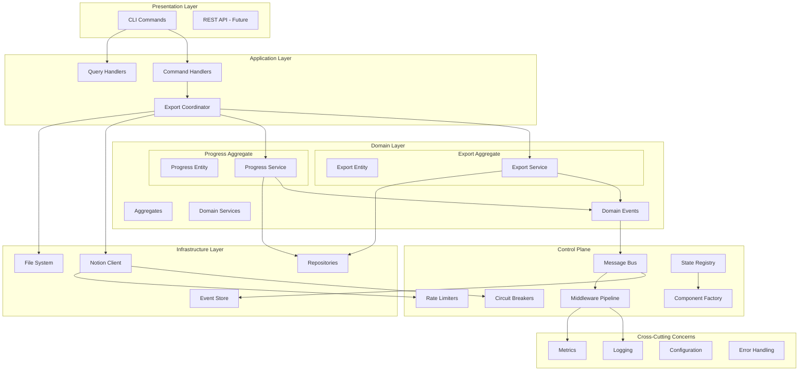
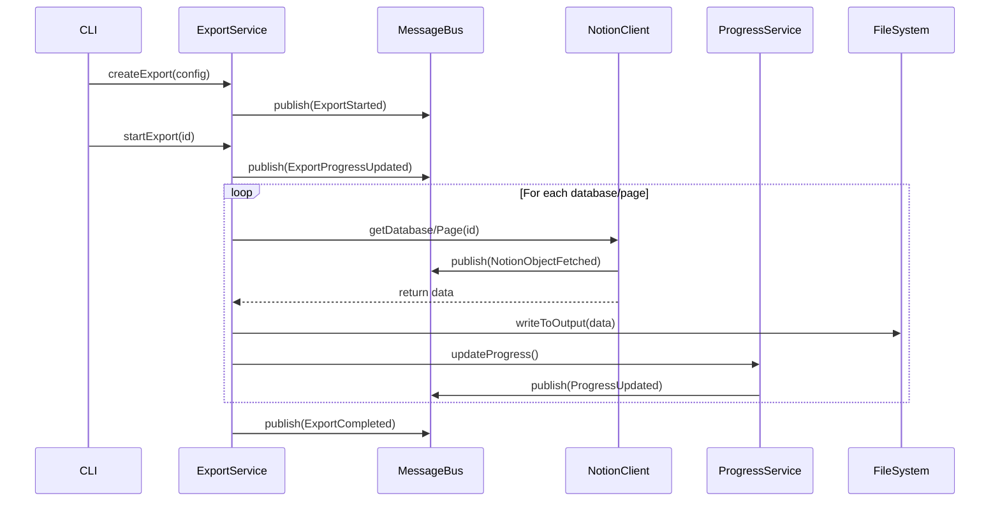

# Notion Sync - Event-Driven Architecture Documentation

## 1. Overview

Notion Sync is designed as an event-driven system for exporting entire Notion workspaces at scale efficiently and stable. The architecture follows Domain-Driven Design (DDD) principles with event sourcing and CQRS patterns to ensure scalability, reliability, and maintainability.

## 2. Architecture Diagram

## 3. Component Dependencies

### 3.1. Core Domain Components

#### 3.1.1. Export Aggregate

- **Location**: `/src/core/domain/export.ts`
- **Dependencies**:
  - IN: ExportConfiguration, ProgressInfo, ErrorInfo
  - OUT: Domain Events (ExportStarted, ExportCompleted, etc.)
- **Responsibilities**:
  - Export lifecycle management
  - Business rule enforcement
  - State transitions

#### 3.1.2. Export Service

- **Location**: `/src/core/services/export-service.ts`
- **Dependencies**:
  - IN: ExportRepository, EventPublisher
  - OUT: Export entities, Domain events
- **Responsibilities**:
  - Export orchestration
  - Conflict detection
  - Progress coordination

#### 3.1.3. Progress Service

- **Location**: `/src/core/services/progress-service.ts`
- **Dependencies**:
  - IN: EventPublisher
  - OUT: Progress events
- **Responsibilities**:
  - Progress tracking
  - ETA calculation
  - Section management

### 3.2. Infrastructure Components

#### 3.2.1. Notion Client

- **Location**: `/src/infrastructure/notion/notion-client.ts`
- **Dependencies**:
  - IN: NotionConfig, EventPublisher, CircuitBreaker
  - OUT: NotionPage, NotionDatabase, NotionBlock, API events
- **Responsibilities**:
  - Notion API integration
  - Rate limit handling
  - Error transformation

#### 3.2.2. Control Plane

- **Location**: `/src/lib/control-plane/`
- **Dependencies**:
  - IN: Configuration, Plugins, Middleware
  - OUT: Message routing, Component lifecycle
- **Responsibilities**:
  - Event routing
  - Component orchestration
  - Cross-cutting concerns

### 3.3. Event Flow

## 4. Event Catalog

### 4.1. Export Events

- `export.started` - Export process initiated
- `export.progress.updated` - Progress information updated
- `export.completed` - Export finished successfully
- `export.failed` - Export failed with error
- `export.cancelled` - Export cancelled by user

### 4.2. Notion API Events

- `notion.object.fetched` - Object retrieved from API
- `notion.rate_limit.hit` - Rate limit encountered
- `notion.api.error` - API error occurred

### 4.3. Progress Events

- `progress.section.started` - New section processing started
- `progress.section.completed` - Section processing completed
- `progress.item.processed` - Individual item processed

### 4.4. File System Events

- `file.created` - File written to disk
- `file.updated` - File modified
- `directory.created` - Directory created

### 4.5. Performance Events

- `performance.metric` - Performance metric recorded
- `concurrency.adjusted` - Concurrency limits adjusted

### 4.6. Circuit Breaker Events

- `circuit_breaker.opened` - Circuit breaker opened
- `circuit_breaker.closed` - Circuit breaker closed
- `circuit_breaker.half_open` - Circuit breaker in half-open state

## 5. Data Flow

### 5.1. Export Process Flow

1. **Initialization**: CLI creates export configuration
2. **Validation**: Export service validates configuration
3. **Planning**: System estimates total work and creates execution plan
4. **Execution**: Parallel processing of databases and pages
5. **Monitoring**: Continuous progress tracking and error handling
6. **Completion**: Final aggregation and cleanup

### 5.2. Error Handling Flow

1. **Detection**: Errors caught at component boundaries
2. **Classification**: Errors categorized (retryable, fatal, etc.)
3. **Recovery**: Automatic retry with exponential backoff
4. **Escalation**: Circuit breaker activation for repeated failures
5. **Reporting**: Error events published for monitoring

### 5.3. State Management Flow

1. **Event Generation**: Domain operations generate events
2. **Event Publishing**: Events published to message bus
3. **Event Processing**: Event handlers update read models
4. **State Persistence**: State changes persisted to storage
5. **State Recovery**: System can rebuild state from events

## 6. Performance Characteristics

### 6.1. Current Limitations

- **Memory Usage**: Unbounded for large workspaces
- **Concurrency**: Limited by in-memory state management
- **Throughput**: Constrained by Notion API rate limits
- **Reliability**: No persistent state for recovery

### 6.2. Target Performance

- **Memory**: Bounded usage regardless of workspace size
- **Concurrency**: Configurable per operation type
- **Throughput**: Maximum sustainable rate within API limits
- **Reliability**: 99.9% success rate with automatic recovery

## 7. Security Considerations

### 7.1. Current Implementation

- API key stored in configuration
- No encryption at rest
- Basic input validation

### 7.2. Required Enhancements

- Secure credential management
- Data encryption in transit and at rest
- Comprehensive input validation
- Audit logging
- Access control for multi-tenant scenarios
