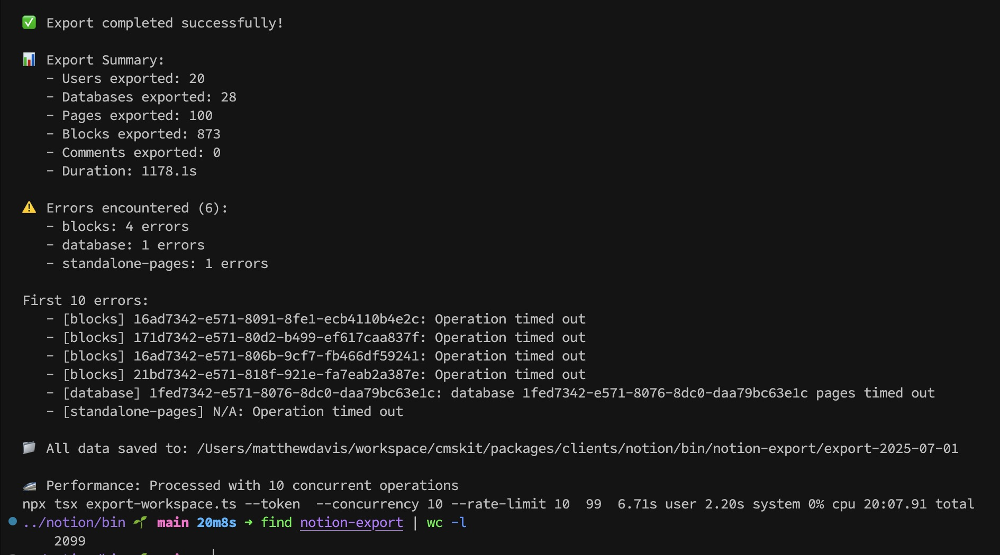
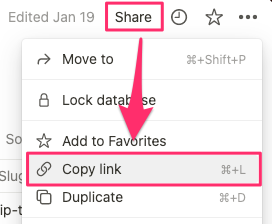

# Notion Sync

Notion Sync is a tool for importing and exporting content to and from Notion.



## Key Features

- 💯 Handles nested pages and blocks like a boss.
- 💾 Export JSON, YAML, or Markdown to disk.
- ⚡️ Dynamic rate limiting that starts aggressive and adapts based on API headers
- 🔀 Operation-type-aware concurrency management with priority queuing
- 📊 Real-time performance monitoring and statistics tracking
- ✅ Comprehensive fault tolerance with fallback mechanisms

## Key Components Needed

- Message Bus
- State Registry
- Component Factory
- Circuit Breaker
- Retry Mechanism
- Rate Limiter
- Plugin & Middleware system

## Main Implementation (workspace-exporter.ts)

- Complete TypeScript implementation with full type safety.
- Exports all Notion workspace content: users, databases, pages, blocks, and comments.
- Recursive block fetching with configurable depth.
- Built-in rate limiting to respect API limits.
- Graceful error handling with detailed error reporting.
- Configurable options for archived content and comments.

## Comprehensive Test Suite (workspace-exporter.test.ts)

- Full test coverage using `vitest`.
- Tests for all methods and edge cases.
- Mocked Notion API responses.
- Tests for error handling, pagination, and rate limiting.

## Documentation (README.md)

- Complete API documentation.
- Usage examples.
- Configuration options.
- Output structure explanation.

## CLI Tool (bin/export-workspace.ts)

- Command-line interface for easy exports.
- Configurable options via command-line arguments.
- Beautiful console output with progress indicators.
- Error reporting and summary statistics.

## Example Usage (example-usage.ts)

- Practical example of how to use the exporter.
- Shows error handling and result processing.

## Prerequisites

### Notion API key

You need to have a Notion API key. You can get one from the Notion API documentation.

> [!NOTE]
> You can get your API key from <https://www.notion.so/profile/integrations>.

### Config file

You need to have a config file. You can create one by running `npx cmskit notion config`.

## Installation

```bash
npm install @mateothegreat/notion-sync
```

## Usage

### Get a Notion API Token

You will need to create an internal Notion integration. You will also want to share your database with the integration.

Your token will look like this: `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`

```ts
import { notion } from "@mateothegreat/notion-sync";
```



## Development

### Discovering the Notion API

You can discover the API by using this postman collection at <https://www.postman.com/notionhq/workspace/notion-s-api-workspace>.

#### Building

First, start the typescript compiler in watch mode:

```bash
npm run compile:watch
```

Then, run the following command to start the application:

#### Running

```bash
npm run start:dev
```
